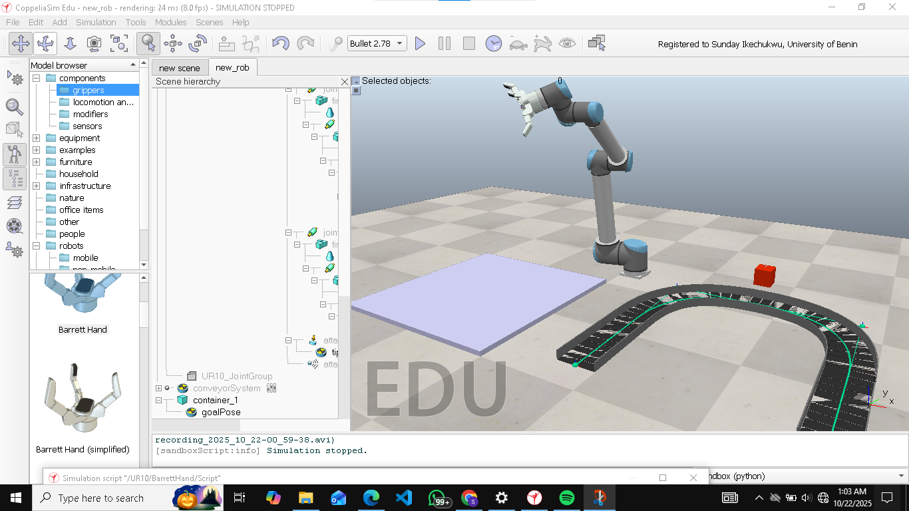

# CoppeliaSim-RobotArm-PickAndPlace

This project simulates a UR10 robot arm with a BarrettHand in CoppeliaSim. The arm performs a full pick-and-place sequence controlled through a Lua script for automated container handling  

## Current Progress
✅ Moved arm to pick position  
✅ Closed gripper to grasp the box  
✅ Moved and released the box at target position and return to initial position
 

## Next Steps
- Integrate vision sensor for object detection  
- Implement path planning using inverse kinematics  
- Visualize trajectory in Python

## Demo

