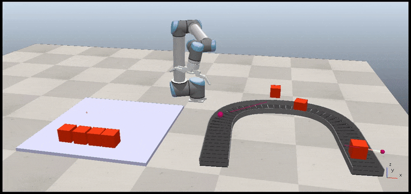

# 📦 CoppeliaSim-RobotArm-PickAndPlace

This repository contains a complete pick-and-place simulation pipeline implemented in CoppeliaSim, using a UR10 robotic arm equipped with a BarrettHand gripper.
The project demonstrates staged control logic and a full autonomous pick–place–return cycle using Lua scripts.

It was originally developed as a teaching and learning resource and has since been extended into a fully integrated, reusable simulation.

## 🎥 Demo
Full Pick-and-Place Execution (UR10 + BarrettHand)
(GIF demo embedded below)

__Additional raw videos showing intermediate stages and the complete demo are available in the videos/ folder.__

## Implemented Features
✅ UR10 robot arm control in CoppeliaSim  
✅ BarrettHand grasping and release control  
✅ Modular stage-based scripts for learning and debugging
✅ Fully integrated complete pick–place–return pipeline
✅ Reproducible .ttt scene for immediate simulation
✅ Visual demo (GIF + raw videos)

## 🧪 Learning Path (How to Use This Repo)

1. __Beginners__
   Start with the scripts/stages/ folder to understand:
   - Arm motion to pick position
   - Gripper closure
   - Placement and return logic

2. __Full Pipeline__
   Load scenes/pick_place_complete.ttt and use the scripts in stages/complete/ for:
   - End-to-end autonomous execution

## 🚀 Future Extensions
- 🔲 Vision sensor integration for object detection
- 🔲 Trajectory visualization and analysis in Python
- 🔲 ROS/ROS2 integration for external control

## 🤝 Contributions & Contact
This project is intended for __learning, experimentation, and extension.__
If you are working on CoppeliaSim, robot manipulation, or pick-and-place systems and have questions or suggestions, feel free to reach out or open an issue.

